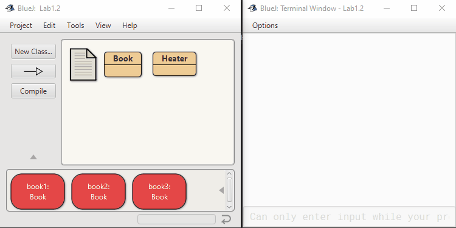
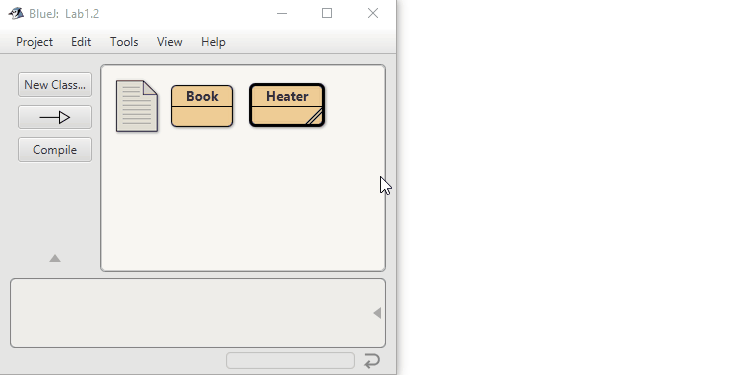

Project: book-exercise

This project is part of the material for the book

   Objects First with Java - A Practical Introduction using BlueJ
   Sixth edition
   David J. Barnes and Michael Kölling
   Pearson Education, 2016

It is discussed in chapter 2.

Purpose of project: This project forms the basis of a set of exercises
                    that can be found in Chapter 2.
How to start this project: Create one or more Book instances.

USER INSTRUCTIONS: Complete the exercises in Chapter 2.

Descriptions from the original files:

 A class that maintains information on a book.
 This might form part of a larger application such
 as a library system, for instance.
 
 @author n-c0de-r
 @version 2021.07.21
 
 
 
 
