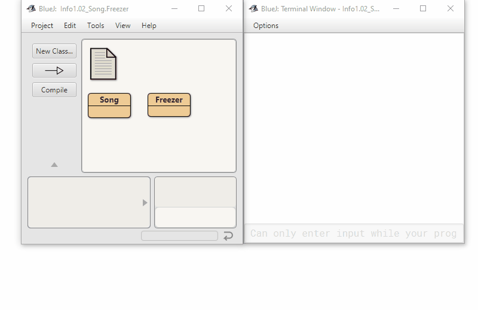

Descriptions from the original files:

 A class that maintains information on a book.
 This might form part of a larger application such
 as a library system, for instance.
 
 Based on the original by David J. Barnes and Michael Kölling
 
 @author    n-c0de-r
 @version   2023.02.05
 
 

 A simple freezer, controlled by the
 methods "cooler" and "warmer".
 
 @author    n-c0de-r
 @version   2023.02.05
 
 
